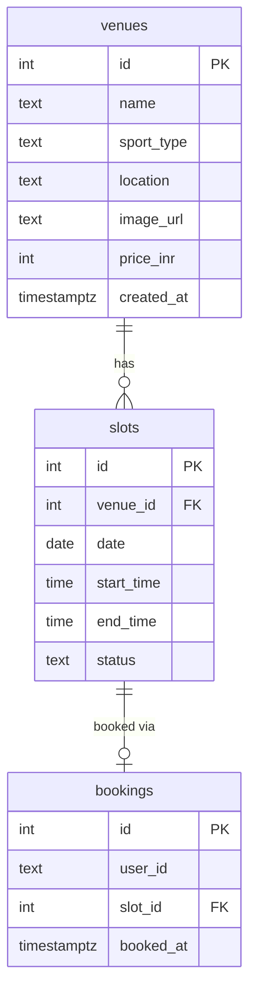
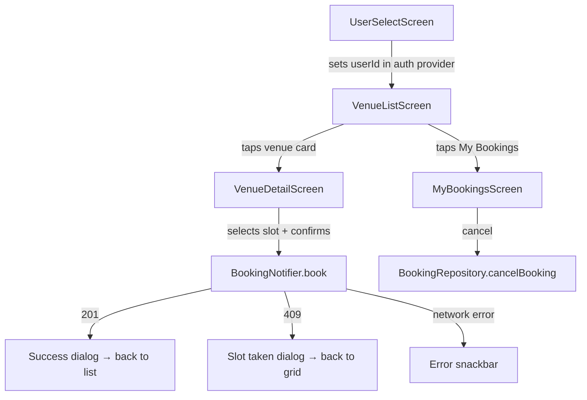

# QuickSlot

Book sports slots — badminton courts, turf grounds. No double bookings.

---

## Deployed stack

The Next.js API is deployed on Railway. The database is Neon — serverless Postgres running on AWS in the Singapore region. The Flutter app on the phone talks directly to the Railway URL, which connects to Neon over a standard Postgres connection string. Both are always live, so the app works without running anything locally.

The `DATABASE_URL` is set as an environment variable in Railway's dashboard and is never committed to the repo. A `.env.example` is included for anyone who wants to run the backend locally instead.

---

## Setup

### Prerequisites

- Flutter 3.29+ with Dart 3.12+
- Node.js 20+
- A PostgreSQL database (Neon, Supabase, or local)

### Option A — Docker

```bash
# from repo root
docker compose up --build
docker compose run --rm seed
```

That starts Postgres, applies the schema automatically, and serves the API on port 3000.

### Option B — Manual

**Backend:**

```bash
cd server
npm install
cp .env.example .env        # set DATABASE_URL
psql $DATABASE_URL -f db/schema.sql
npx tsx db/seed.ts
npm run dev                 # http://localhost:3000
```

**Flutter app:**

```bash
cd app
flutter pub get
flutter run
```

Physical device note: update `baseUrl` in `lib/core/constants/api_constants.dart` to your machine's local IP. The default `10.0.2.2:3000` works for Android emulator only.

---

## Architecture

### High-level

```
┌─────────────────────┐        HTTP/JSON        ┌──────────────────────────┐
│   Flutter (Android) │ ─────────────────────── │   Next.js API (Node.js)  │
│                     │                         │                          │
│  Riverpod providers │                         │  /api/venues             │
│  GoRouter           │                         │  /api/venues/[id]/slots  │
│  Dio HTTP client    │                         │  /api/bookings           │
└─────────────────────┘                         │  /api/bookings/[id]      │
                                                │  /api/users/[id]/bookings│
                                                └──────────┬───────────────┘
                                                           │ pg driver
                                                    ┌──────┴───────┐
                                                    │  PostgreSQL  │
                                                    │  venues      │
                                                    │  slots       │
                                                    │  bookings    │
                                                    └──────────────┘
```

---

## Low Level Design

### Backend



**API routes and their responsibilities:**

| Method | Route | What it does |
|--------|-------|-------------|
| GET | `/api/venues` | List all venues |
| GET | `/api/venues/[id]/slots?date=` | Slots for a venue on a given date |
| POST | `/api/bookings` | Create a booking (uses SELECT FOR UPDATE transaction) |
| DELETE | `/api/bookings/[id]` | Cancel a booking, frees the slot |
| GET | `/api/users/[id]/bookings` | All bookings for a user |

**The booking transaction (how double-bookings are prevented):**

```
POST /api/bookings
  BEGIN
    SELECT id, status FROM slots WHERE id = $slot_id FOR UPDATE
    if status = 'booked'  →  ROLLBACK  →  409 Conflict
    UPDATE slots SET status = 'booked' WHERE id = $slot_id
    INSERT INTO bookings (user_id, slot_id) VALUES (...)
  COMMIT
  → 201 Created
```

The `FOR UPDATE` locks the row for the duration of the transaction. Two simultaneous requests for the same slot will queue at that line — whichever arrives second reads the already-updated status and returns 409. There is also a `UNIQUE(slot_id)` constraint on the bookings table as a hard database-level backstop.

---

### Frontend



**Flutter feature structure:**

```
lib/
├── core/
│   ├── constants/         API base URL
│   ├── error/             Result<T> type  (Success / Failure)
│   ├── network/           Dio client with X-User-Id interceptor
│   ├── router/            GoRouter named routes
│   └── theme/             colours, typography, card styles
│
└── features/
    ├── auth/
    │   ├── providers/     authProvider  (stores selected userId)
    │   └── screens/       UserSelectScreen
    │
    ├── venues/
    │   ├── data/
    │   │   ├── models/    VenueModel, SlotModel  (fromJson)
    │   │   └── repos/     VenueRepository, SlotRepository
    │   ├── domain/
    │   │   └── entities/  VenueEntity, SlotEntity  (plain Dart)
    │   └── presentation/
    │       ├── providers/ venueListProvider, slotListProvider (FutureProvider)
    │       │              selectedDateProvider, selectedSlotProvider (StateProvider)
    │       │              slotTimeFilterProvider  (StateProvider — Morning/Afternoon/Evening)
    │       └── screens/   VenueListScreen, VenueDetailScreen
    │
    └── bookings/
        ├── data/
        │   ├── models/    BookingModel  (fromJson + local cache serialisation)
        │   └── repos/     BookingRepository  (network + SharedPreferences cache)
        ├── domain/
        │   └── entities/  BookingEntity
        └── presentation/
            ├── providers/ BookingNotifier  (idle→loading→success|slotTaken|failed)
            │              userBookingsProvider  (FutureProvider)
            └── screens/   MyBookingsScreen
```

**State flow inside BookingNotifier:**

```
idle
 └─ book() called
     └─ loading
         ├─ 201 OK        → success
         ├─ 409 Conflict  → slotTaken
         └─ other error   → failed  (with errorMessage)

reset() → idle  (from any state)
```

---

## What I cut

Real-time slot updates — if one user books a slot while another is looking at the same grid, the second user's grid won't update until the 30-second poll fires or they change the date. The concurrency protection still works (they get the slot-taken dialog), but the grid is not instantaneous. Fixing this properly means a WebSocket or SSE channel on the server side.

Auth is three hardcoded users, as the spec asks. The user ID goes out as an `X-User-Id` header and the backend trusts it. In a real app this would be a signed JWT with middleware to verify it.

---

## What I would do with one more day

WebSocket live slot updates so the grid reflects changes from other users in real time, without polling. Hive instead of SharedPreferences for offline storage, so bookings can be queried and filtered locally without loading the full JSON blob. A wider test suite covering the slot grid widget — tapping available vs booked chips, confirming the booking flow renders the right dialogs.

---

## Running tests

```bash
cd app
flutter test test/booking_notifier_test.dart
```

7 tests covering the BookingNotifier state machine — idle default, reset behaviour, state transitions, enum completeness.

---

## AI usage note

I used Antigravity (Google DeepMind) as a coding pair throughout this project.

It was useful for: scaffolding the clean-architecture folder structure, writing the SELECT FOR UPDATE transaction correctly on the first try, and iterating quickly on UI changes across many files at once.

Where it went wrong — the Android navigation bar stayed black after every Flutter-side fix it attempted. It kept trying SystemChrome calls and AnnotatedRegion before I pointed it toward the native MainActivity.kt and styles.xml route, which is where the actual fix lives on Android 10+. An early version of the offline cache also only stored booking IDs instead of full entities, which would have made the offline view empty — I caught that during code review and had it corrected.
